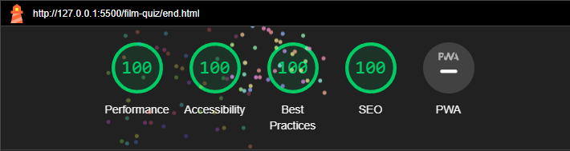

# Movie Trivia Quiz

Visit the live website [here.](https://kb5991.github.io/film-quiz/)

Movie trivia is an online trivia quiz for players wanting to test their knowledge about movies. The objective is to try and answer the questions correctly to get your score to go up.

## User Experience

### Target Audience

This site is targeted at any web users who want to play a quick and fun quiz to test their movie knowledge, either on their own or with friends.

### User Expectations

- Ease of use on all screen sizes with a responsive design.
- A simple design making it easy to get to both the game and the leaderboard for comparison of scores.
- Game feedback for when correct or incorrect answers have been chosen.
- Progress updates on scores and the number of questions left throughout the game.
- A simple and easy way to save your name and score to the leaderboard.
- A simple and easy way to restart the game upon completion.

### User Stories

1. As a player, I want the game to be smooth and functional when playing, with fast loading times for a smooth experience.

2. As a player, I want to be able to see my score update throughout the quiz.

3. As a player, I want feedback from the game when I have clicked on a correct or incorrect answer.

4. As a player I want to be able to save my score to compare it with other players.

5. As a player I want it to be easy to restart the game again upon completion.

## Design

### Wireframes

The wireframes for this website were created using Balsamiq.com to help with the design of the site. The website consists of five pages in total, the Home page, the Game page, the End page, the Leaderboard page and the Error page.

1. Homepage 

2. Game page 

3. End page 

4. Leaderboard page 

### Colour Scheme

The colour scheme for this website is simple and chosen mainly for accessibility purposes. I have chosen a grey background with white text throughout, with red and yellow buttons for differentiation.

### Typography

For this website I have used the simple sans serif font, Roboto from Google Fonts throughout the website to make all of the text consistent and easy to read.

### Features

### Search Engine Optimisation

I have added meta tags in the head of each page containing descriptions and keywords in order to improve the optimisation, ranking, quality and quantity of the website traffic.

### Homepage 

The homepage for the website shows a simplistic design featuring the title of the page "How well do you know your movies?" followed by a simple image and two clear buttons inviting the user to either click play and start the quiz or to view the leaderboard to see any locally saved scores.

1. Homepage on desktop

2. Homepage on mobile 

### Main Quiz Page

Upon clicking play, the user is taken to the quiz page, presenting them with the first question of the quiz with four available answer options to choose from. On the top left the user is provided with information on which question they are currently on and how many are remaining. This is also followed by a progress bar which will fill up with green as the game progresses. On the top left, the user is shown their current score. This will go up in increments of 100, depending on how many correct answers they choose. If the user has chosen a correct answer, the answer will flash green. If the user has chosen an incorrect answer, the answer will flash red.

1. Quiz page on desktop

2. Quiz page on mobile 

3. Progress and score bars

### End page 

Upon completion of the quiz, the user is redirected to the end page where they are met with a form to submit their name and save their score to the leaderboard should they wish to. The save button has been set to disabled until a key is pressed in the input field and a name has been written. If a player does not wish to save their score, if they haven't done as well as they had hoped for example, they are able to click the play again button and try again. Alternatively, they can choose to click on the home button and be redirected to the home page. The top left of the page shows the score that they ended with.

1. End page on desktop

2. End page on mobile 

### Leaderboard page

The leaderboard page can be accessed from the homepage, upon completion of the form on the end page users are redirected to the homepage where they can click on the leaderboard. The leaderboard will show a list of high scores previously saved by the user, encouraging players to save their scores to reach the top of the leaderboard.

1. Leaderboard page on desktop

2. Leaderboard page on mobile  

### 404 Error Page

If the user clicks on a broken link, they are redirected to the 404 error page which invites them to click on a link which will redirect them to the homepage.

1. Error page on desktop

2. Error page on mobile

### Notifications

Users are notified when they have chosen a correct or incorrect answer to a question with the answer flashing green for correct and red for incorrect. Users are unable to push the save button on the end page to save their score until a name has been entered.

1. Correct Answer 

2. Incorrect Answer

### Future Developments

In future developments, I would like to add more questions to the quiz so that users can test their knowledge further. It would also be helpful to make the leaderboard save scores globally as it currently only shows scores saved locally on the same device, this development would allow users to play more competitively across the globe.

## Technologies Used

**Github** - used for version control, site storage and for deploying my project.\
**Github Pages** - used for deploying my project.\
**Codeanywhere** - this is the main IDE that I used to write, edit, commit and push my code to Github.\
**VS Code** - this is the IDE that I used to write, edit, commit and push changes to Github with once I encountered an issue Codeanywhere experiencing an outage.\
**Python** - used to open a local http server when coding in Codeanywhere to preview my site.\
**HTML 5** - used to build the basic elements of my website.\
**CSS** - used to style all elements of my website.\
**DevTools** - used to test the responsiveness of my website and check for bugs.\
**Google Fonts** - used to import the font Roboto used on my site.\
**Font Awesome** - used to import the icons for the play and leaderboard buttons on the homepage.\
**Pexels** - used to source website imagery.\
**TinyPNG** - used to compress website imagery.\
**Favicon.io** - used to create favicon for my website.\
**Beautify extension on Codeanywhere** - used to format code correctly.\
**Balsamiq** - used to create the wireframes for the initial design process of my website.\
**Am I Responsive?** - used to test the responsiveness of the website.\
**W3C Markup Validation Service** - used to validate HTML code.\
**W3C CSS Validation Service** - used to validate CSS code.\
**WAVE Accessibility Tool** - used to test accessibility.\
**Lighthouse** - used to generate Lighthouse reports.

## Languages Used

HTML 5, CSS, JavaScript

## Libraries and programmes used

Github was used for version control, site storage and for deploying my project to Github pages. Codeanywhere and VS Code are the IDE's I used to write, edit, commit and push my code to Github.

## Deployment

I deployed my website early on Github pages.

## Local Deployment

#### How to Clone

1. Log into your account on GitHub
2. Go to the repository of this project <https://github.com/kb5991/film-quiz>
3. Click on the code button, and copy your preferred clone link.
4. Open the terminal in your code editor and change the current working directory to the location you want to use for the cloned directory.
5. Type 'git clone' into the terminal, paste the link you copied in step 3 and press enter.

#### How to Fork

To fork the repository:

1. Log in (or sign up) to Github.
2. Go to the repository for this project, <https://github.com/kb5991/film-quiz>
3. Click the Fork button in the top right corner.

## Testing

### Manual Testing

1. WC3 Validator used to validate the HTML 5 code written on all pages of my website - no errors found. 

2. Jigsaw CSS Validator used to validate the CSS code written for my website - no errors found.

3. Lighthouse testing - I used Google Chrome's Lighthouse Developer Tool for insight on the performance and accessibility measures of my website.

Index page:

Game page:

End page:

Leaderboard:

### Device Testing

The website was tested on the following devices:

- iPhone 13 Pro

- iPhone 13 Pro Max

- Macbook Pro 13" 2020

- ASUS Rog Strix Gaming Laptop 15.6"

- 24" widescreen monitor

The website was tested on the following browsers:

- Google Chrome

- Safari

- Microsoft Edge

|       Feature        |                                      Expected Outcome                                       |                     Testing Performed                      |                        Result                         | Pass/Fail |
| :------------------: | :-----------------------------------------------------------------------------------------: | :--------------------------------------------------------: | :---------------------------------------------------: | :-------: |
|  **Main Page**  |
|                      |                                                                                             |                                                            |                                                       |           |
|Play Button |                    When clicked the user should be redirected to main quiz page                     |                       Clicked Play Button                        |                Redirected to main quiz page                |   Pass    |
|   Leaderboard Button    |                 When clicked the user should be redirected to leaderboard page                 |                        Clicked Leaderboard Button                        |                Redirected to leaderboard page               |   Pass    |
|  **Main Quiz**   |                                |                                                |                             |       |
|          |    |     |    |       |
|     Answer Buttons    |           When clicked the choice button should flash green or red confirming if answer is correct/incorrect and new content should load            |                       Clicked Answer Buttons                        |      Choice button flashes green or red in response to correct/incorrect answer chosen   |   Pass    |
|     Progress Bar    |           When the next question appears, the progress bar should fill green in increments to show that the quiz is progressing            |                       Clicked Answer Buttons                        |      Progress bar fills when new question is loaded   |   Pass    |
|     Question _ of 5 progress |           When the next question appears, this function should change appropriately to show that the quiz is progressing (e.g. Question 2 of 5)            |                       Clicked Answer Buttons                        |      Question progress changes appropriately to show the user which question out of 5 they are currently on   |   Pass    |
|    Incrementing Score   |                    When correct answer is selected the user score should increase by 100                  |                    Selected correct answer                     |                      Score increased by 100                      |   Pass    |
|   **End Page**   |
|                      |                                                                                             |                                                            |                                                       |           |
|     Save Button- Username Given    | When clicked username and score should save to leaderboard, and user should be redirected to the main page - button is disabled until a name is entered in the field | Clicked Save Score button | Score saved and user is redirected back to main page. User is not able to save until a name is entered into the field |   Pass    |
|     Score Saves to Local Storage    | When save button is clicked, using chrome developer tools the application tab should show the newly saved data to the local storage | Clicked Save Score button | Score and username appears as saved data via chrome developer tools |   Pass    |
|     Play Again Button     |                      When clicked, user is redirected to the quiz page, and user score should reset to 0                      |                    Clicked Play Again Button                |                  Quiz restarts and score resets to 0                 |   Pass    |
|     Home Button     |                      When clicked, user is redirected to the home page                     |                    Clicked Home Button                |                  User is redirected to Home page                |   Pass    |

### Accessibility

To make the website accessible, I have used aria-labels and alt tags, and semantic elements to ensure that navigation throughout the site is easy. The colour scheme has also been chosen to ensure high contrast and accessibility. The choice buttons are a lighter shade of grey in comparison to the darker grey background of the website to show a clear difference between the two areas, the lighter grey shade used for the choice buttons however, is still dark enough to ensure that the white text shows through. I have used the WAVE accessibility tool to test this which has come up with no errors.

1. WAVE accessibility testing. 

## Bugs

Whilst trying to make my website responsive, I came across an issue with DevTools not responding to changes accurately which made building this website responsively incredibly challenging as I was not always able to see if my changes had been implemented correctly. 

For example, one screen size 768px on DevTools, the main quiz page sometimes shows up looking like this:

However, once I leave DevTools, refresh the page, and reenter DevTools, opening the website up on the same 768px screen size, the main quiz page shows up as it is supposed to with the correct media queries in place.

This made it very hard to see which media queries I should be implementing and so I had to repeat this process of refreshing every page multiple times on various screen sizes to see if my changes had been implemented.

## Credits

### Code Used
For the code writing and game functions of this website, I used the following tutorial:
- [Brian Design](https://www.youtube.com/watch?v=f4fB9Xg2JEY)

### Images
Images were sourced from pexels.com and the favicon was generated using favicon.io.

### Quiz Questions
Quiz questions were sourced from the following website with the incorrect answers written by me. 
- [Radio Times](https://www.radiotimes.com/quizzes/pub-quiz-action-movie/)

### Acknowledgements
I would like to thank my fellow Code Institute students from the Slack community who have been very helpful with answering my questions. I would also like to thank my mentor Luke who has been very supportive and constructive with his feedback.
